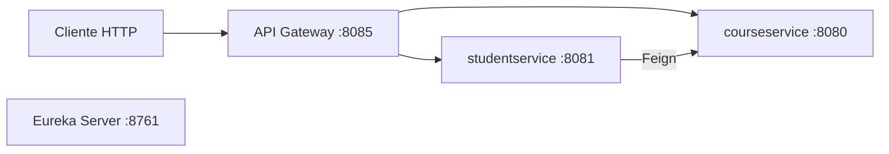

# Spring Microservices Architecture

# Student | Course


## 🧭 Guia de Navegação (Índice)

- **[📖 Descrição](#descricao)**
- **[🧩 Visão geral](#visão-geral)**
- **[🏗️ Arquitetura](#arquitetura)**
- **[🛠️ Stack e versões](#stack-e-versões)**
- **[📁 Estrutura dos módulos](#estrutura-dos-módulos)**
- **[🚪 Portas e serviços](#portas-e-serviços)**
- **[⚙️ Configuração de ambiente](#configuração-de-ambiente)**
- **[▶️ Como executar localmente](#como-executar-localmente)**
- **[🧭 Rotas expostas no Gateway](#rotas-expostas-no-gateway)**
- **[🧪 Exemplos de requisição](#exemplos-de-requisição)**
- **[✅ Build e testes](#build-e-testes)**
- **[📌 Observações importantes](#observações-importantes)**
- **[👤 Sobre o Desenvolvedor](#sobre-o-desenvolvedor)**
- **[📜 Licença](#licenca)**

## 📖 Descrição <a name="descricao"></a>

Projeto de estudo com arquitetura de microserviços usando **Spring Boot 3**, **Spring Cloud Gateway**, **OpenFeign**, **JPA** e **PostgreSQL**.

## 🧩 Visão geral <a name="visão-geral"></a>

O sistema possui dois microserviços de domínio:

- **courseservice**: cadastro e consulta de cursos.
- **studentservice**: cadastro e consulta de estudantes, com integração ao serviço de cursos.

Também inclui componentes de infraestrutura:

- **api_gateway**: roteamento de requisições para os serviços.
- **eurekaserver**: servidor de service discovery.

## 🏗️ Arquitetura <a name="arquitetura"></a>



## 🛠️ Stack e versões <a name="stack-e-versões"></a>

- Java **21**
- Maven (multi-módulo)
- Spring Boot **3.2.5**
- Spring Cloud **2023.0.1**
- PostgreSQL

## 📁 Estrutura dos módulos <a name="estrutura-dos-módulos"></a>

```text
stud_course_microservice/
├── pom.xml                 # POM pai (packaging pom)
├── courseservice/          # CRUD de cursos
├── studentservice/         # CRUD de estudantes + integração com cursos
├── api_gateway/            # Gateway de entrada
└── eurekaserver/           # Service discovery
```

## 🚪 Portas e serviços <a name="portas-e-serviços"></a>

- `eurekaserver`: **8761**
- `api_gateway`: **8085**
- `courseservice`: **8080**
- `studentservice`: **8081**

## ⚙️ Configuração de ambiente <a name="configuração-de-ambiente"></a>

Os serviços `courseservice` e `studentservice` usam variáveis de ambiente para conexão com banco.

Copie os exemplos:

```bash
cp courseservice/.env.example courseservice/.env
cp studentservice/.env.example studentservice/.env
```

Defina em cada `.env`:

```dotenv
DB_URL=jdbc:postgresql://localhost:5432/seu_banco
DB_USERNAME=seu_usuario
DB_PASSWORD=sua_senha
```

> Observação: o projeto usa `ddl-auto: update`, então as tabelas são criadas/atualizadas automaticamente.

## ▶️ Como executar localmente <a name="como-executar-localmente"></a>

### 1) Subir banco PostgreSQL

Garanta que o PostgreSQL esteja ativo e acessível pelas credenciais configuradas.

### 2) Iniciar os serviços (ordem sugerida)

Em terminais separados, na raiz `stud_course_microservice`:

```bash
mvn -pl eurekaserver spring-boot:run
mvn -pl courseservice spring-boot:run
mvn -pl studentservice spring-boot:run
mvn -pl api_gateway spring-boot:run
```

### 3) URLs úteis

- Eureka dashboard: `http://localhost:8761`
- Gateway base: `http://localhost:8085`

## 🧭 Rotas expostas no Gateway <a name="rotas-expostas-no-gateway"></a>

O Gateway remove o prefixo `/api` e encaminha para os serviços internos.

### Courses

- `POST /api/courses`
- `GET /api/courses`
- `GET /api/courses/{id}`

### Students

- `POST /api/students`
- `GET /api/students`
- `GET /api/students/{id}`
- `GET /api/students/{id}/course` (retorna estudante + dados do curso via Feign)

## 🧪 Exemplos de requisição <a name="exemplos-de-requisição"></a>

### Criar curso

```bash
curl -X POST http://localhost:8085/api/courses \
  -H "Content-Type: application/json" \
  -d '{
    "cname": "Arquitetura de Microserviços",
    "cdescription": "Conceitos e prática com Spring"
  }'
```

### Criar estudante

```bash
curl -X POST http://localhost:8085/api/students \
  -H "Content-Type: application/json" \
  -d '{
    "sname": "Alan",
    "fees": 1200.0,
    "cid": 1
  }'
```

### Buscar estudante com curso

```bash
curl http://localhost:8085/api/students/1/course
```

## ✅ Build e testes <a name="build-e-testes"></a>

Na raiz do projeto:

```bash
mvn clean install
```

Para rodar testes de um módulo específico:

```bash
mvn -pl courseservice test
mvn -pl studentservice test
```

## 📌 Observações importantes <a name="observações-importantes"></a>

- A comunicação entre `studentservice` e `courseservice` usa Feign com URL fixa (`http://localhost:8080`).
- O Gateway está configurado com rotas estáticas para `localhost`.
- O `eurekaserver` está disponível, mas o roteamento atual não depende de descoberta dinâmica para funcionar.

## 👤 Sobre o Desenvolvedor <a name="sobre-o-desenvolvedor"></a>

<table align="center">
  <tr>
    <td align="center">
        <br>
        <a href="https://github.com/0nF1REy" target="_blank">
          
        </a>
        </p>
        <a href="https://github.com/0nF1REy" target="_blank">
          <strong>Alan Ryan</strong>
        </a>
        </p>
        ☕ Peopleware | Tech Enthusiast | Code Slinger ☕
        <br>
        Apaixonado por código limpo, arquitetura escalável e experiências digitais envolventes
        </p>
          Conecte-se comigo:
        </p>
        <a href="https://www.linkedin.com/in/alan-ryan-b115ba228" target="_blank">
          
        </a>
        <a href="https://gitlab.com/alanryan619" target="_blank">
          
        </a>
        <a href="mailto:alanryan619@gmail.com" target="_blank">
          
        </a>
        </p>
    </td>
  </tr>
</table>

</div>

---

## 📜 Licença <a name="licenca"></a>

Este projeto está sob a **licença MIT**. Consulte o arquivo **[LICENSE](LICENSE)** para obter mais detalhes.

> ℹ️ **Aviso de Licença:** &copy; 2026 Alan Ryan da Silva Domingues. Este projeto está licenciado sob os termos da licença MIT. Isso significa que você pode usá-lo, copiá-lo, modificá-lo e distribuí-lo com liberdade, desde que mantenha os avisos de copyright.

⭐ Se este repositório foi útil para você, considere dar uma estrela!
